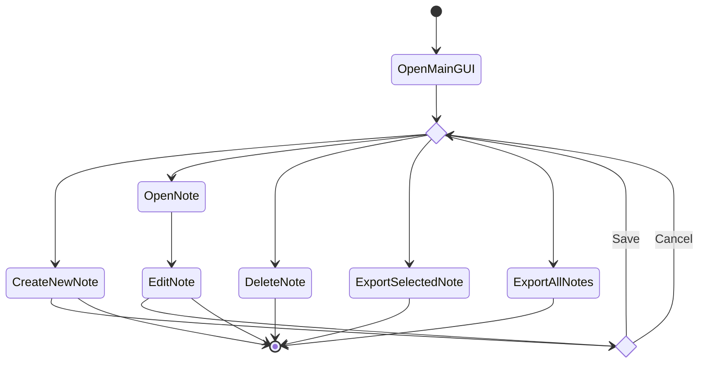
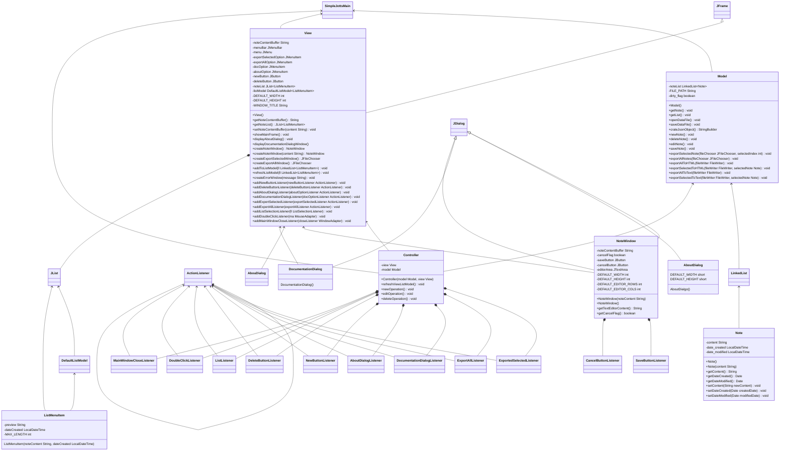

**Table of Contents**

- [Introduction](#introduction)
	- [Repository Location](#repository-location)
- [Build Guide](#build-guide)
- [Style Guide](#style0guide)
- [Design](#design)
	- [Activity Diagram](#activity-diagram)
	- [Class Diagram](#class-diagram)

- - -

# Introduction

This manual is to help new people understand the structure and relationships between different parts of the applications.

## Repository Location

The repository can be in any folder anywhere you like in your system.

# Build Guide

Before you can compile and build the project, you will need the package [org.json](https://github.com/stleary/JSON-java) from strealy on GitHub. Put this package in a folder called `lib` and rename the jar file `json-java.jar`.

To build the project, run the following in the `src` folder:

```bash
javac -cp ../lib/json-java.jar; -d ../classes org/simplejotts/main/SimpleJottsMain.java
```

Then, to run the project:

```bash
java -cp ../lib/json-java.jar; org/simplejotts/main/SimpleJottsMain
```

# Style Guide

The following is the styling guide for the source code:

- For class names, use nouns and camel case with the first letter upper-case.
	- Ex: `ClassName`.
- For variable names, use nouns and camel case with the first letter in lower-case.
	- Ex: `variableName`.
- Method names will be verbs and camel case with the first letter in lower-case.
	- Ex: `createObject()`, `saveFile()`
- When a method or class is extremely long, at the closing brace, put a comment with the word "end" and the name of the method or class.
- Use tabs for indentation.
	- Configure your editor to use four spaces to represent tabs, code should align properly.
- Constants are in UPPER CASE.
- Use comments like headings in a document to communicate particular sections of code.
	- You can also use these headings to easily jump around in the source file.

# Design

## Activity Diagram

The following is the activity diagram that shows what actions happen.



## UML Class Diagram

The following is the UML class diagram of the application. It may appear weird because of how Mermaid.js draws the diagram.



